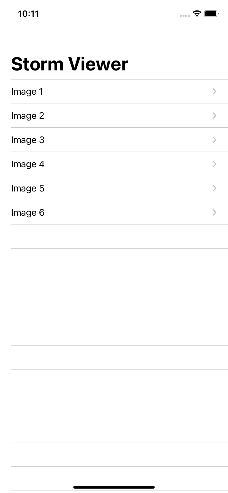
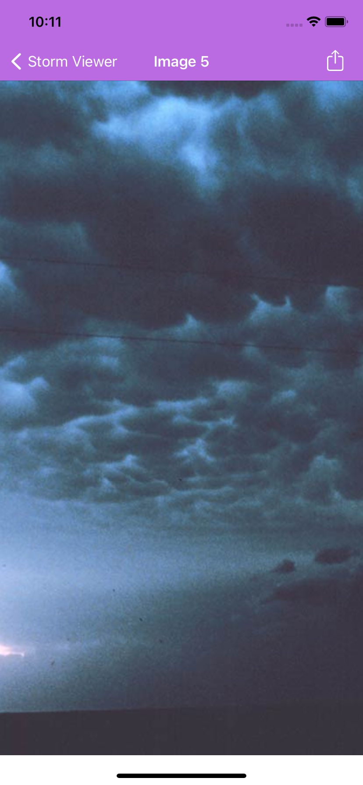
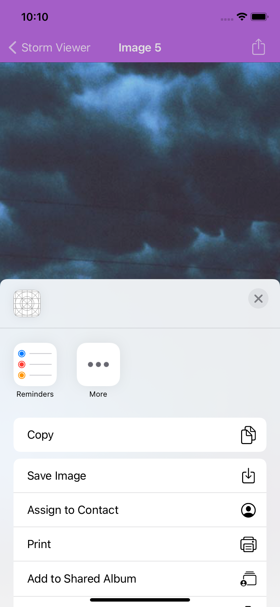

# StormViewer

## Description

The app based on [Project 1](https://www.hackingwithswift.com/read/1/overview) and [Project 3](https://www.hackingwithswift.com/read/3/overview) on Hacking with Swift

The app that contains a collection of images organized in UITableView:

 By tapping on any cell the new window opens with the image itself:
 

By tapping on the right button on the top a user can share the chosen photo:

## Skills

The following topics were covered in this project:
* Navigation Controller
* UITableViewController
* UIImageView
* File Manager
* UIActivityViewController (including #selector and @objc)
